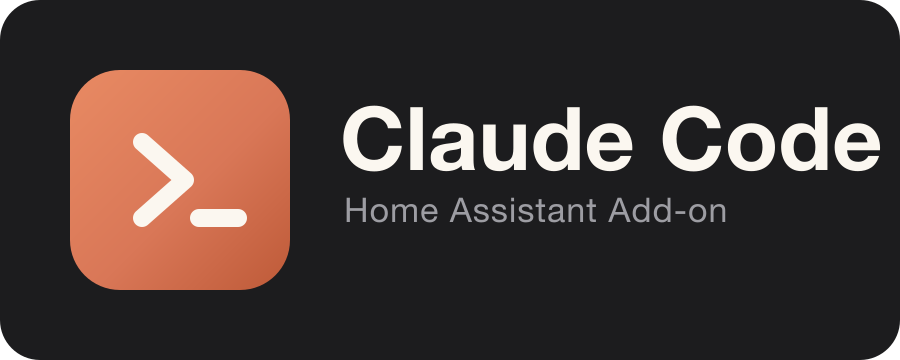
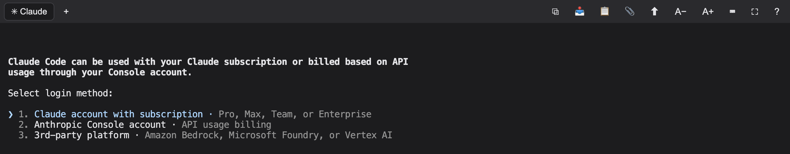

<div align="center">



# Claude Code — Home Assistant Add-on

Anthropic's [Claude Code](https://code.claude.com/docs) CLI, embedded in Home Assistant as a polished web console — right in the sidebar.

[](https://my.home-assistant.io/redirect/supervisor_add_addon_repository/?repository_url=https%3A%2F%2Fgithub.com%2FLayerTM%2FClaudeInHA)

[](https://github.com/LayerTM/ClaudeInHA/actions/workflows/lint.yml)
[](https://github.com/LayerTM/ClaudeInHA/actions/workflows/secret-scan.yml)




</div>

## Features

- **Real Claude Code CLI** — skills, plugins, MCP servers, and slash commands all work
- **Zero-prep HA toolkit** — a bundled Home Assistant skill pack (`/ha-automation`, `/ha-debug`, `/ha-screenshot`, …), general plugins (superpowers, frontend-design, …), and the `ha`/`yq`/`hass-cli` tools, all preinstalled and persisted across updates
- **Browser testing built in** — Chromium is preinstalled; screenshot any dashboard with `ha-shot`, or use the Playwright MCP for interactive checks
- **Tabs** — the Claude session alongside any number of shell tabs
- **Clipboard that works everywhere**, including plain-HTTP setups and the mobile companion app
- **Attachments** — drag & drop files, paste images, or pick from your camera/gallery
- **One-click CLI updates** without restarting the add-on (auto-update on start included)
- **Full Home Assistant access** — config files, REST API, Supervisor API, and (with an HA token) WebSocket
- **Session persistence** via tmux — closing the browser never kills Claude
- **Mobile-friendly** — touch key bar, full-screen kiosk mode, installable as a PWA
- **Remote Control** (optional) — drive the session from the official Claude mobile app

## Installation

1. Click the badge above, or add this repository under
   **Settings → Add-ons → Add-on Store → ⋮ → Repositories**:
   ```
   https://github.com/LayerTM/ClaudeInHA
   ```
2. Install **Claude Code** from the store and start it.
3. Open the **Claude Code** panel in the sidebar.

Authenticate by running `claude` in the console and following the login URL
(subscription), or set an API key / OAuth token in the configuration. See the
[documentation](claude-code/DOCS.md) for details.

## Requirements

- Home Assistant OS or Supervised (`amd64` or `aarch64`)
- A Claude subscription (Pro/Max/Team) or an Anthropic API key

## Documentation

Full documentation lives in the add-on's **Documentation** tab, or in
[`claude-code/DOCS.md`](claude-code/DOCS.md).

## License

[MIT](LICENSE) © 2026 LayerTM

Claude and Claude Code are products of Anthropic. This is an independent,
community-maintained add-on and is not affiliated with or endorsed by
Anthropic or the Home Assistant project.
